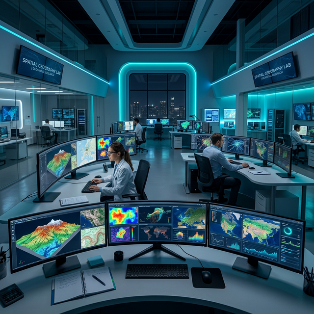

::: {.page-header}
# Gallery
Visualizing our spatial research — from satellite to field
:::

## Research Visualizations

Our research produces rich geospatial outputs spanning deep learning-based classification maps, GEE time-series analyses, terrain models, and field survey documentation.

::: {.gallery-grid}

::: {.gallery-item}

::: {.gallery-overlay}
#### LULC Classification Map
Deep learning (CNN)-based automated land use/land cover classification from Sentinel-2 imagery, validated with field-collected GPS points.
:::
:::

::: {.gallery-item}

::: {.gallery-overlay}
#### Digital Elevation Model
High-resolution terrain visualization with color-coded elevation, derived from QGIS DEM processing for watershed and geomorphological analysis.
:::
:::

::: {.gallery-item}

::: {.gallery-overlay}
#### Climate Anomaly Map
Global temperature anomaly visualization using ML spatial prediction models, validated against ground station observations.
:::
:::

::: {.gallery-item}

::: {.gallery-overlay}
#### Lab Workspace
Our GIS laboratory with GPU workstations for deep learning training and QGIS/GEE analysis workflows.
:::
:::

::: {.gallery-item}

::: {.gallery-overlay}
#### GEE Change Detection
Google Earth Engine-based multi-temporal land cover change analysis with Random Forest classification outputs.
:::
:::

::: {.gallery-item}

::: {.gallery-overlay}
#### Terrain Analysis (QGIS)
QGIS-processed terrain derivatives: slope, aspect, curvature, and TWI for hydrological and suitability modeling.
:::
:::

:::

---

## Fieldwork & Ground Validation

::: {.grid-3}

::: {.feature-card}
::: {.feature-icon}
<i class="fas fa-map-marked-alt"></i>
:::
### GPS Ground-Truth Surveys
Systematic GPS-based field campaigns collecting training and validation samples at 1,200+ stratified random locations for remote sensing accuracy assessment.
:::

::: {.feature-card}
::: {.feature-icon}
<i class="fas fa-search-location"></i>
:::
### Sequential Exploratory Research
Field-based exploratory investigation of landscape patterns, verifying satellite-derived change hotspots, and documenting ground conditions through structured observation protocols.
:::

::: {.feature-card}
::: {.feature-icon}
<i class="fas fa-helicopter"></i>
:::
### UAV/Drone Surveys
Drone-based aerial surveys using RTK-enabled platforms for photogrammetric mapping, crop monitoring, and centimeter-resolution site documentation.
:::

:::

---

## Computational Outputs

::: {.grid-2}

::: {.resource-card}
::: {.resource-icon}
<i class="fas fa-brain"></i>
:::
### Deep Learning Models
- CNN, U-Net, ResNet LULC classifiers
- Vision Transformer satellite image models
- SAR-Optical attention fusion networks
- Transfer learning benchmark results
- All models shared on [GitHub](https://github.com/spatialgeography)
:::

::: {.resource-card}
::: {.resource-icon}
<i class="fas fa-cloud"></i>
:::
### GEE & QGIS Workflows
- Multi-temporal composite generation
- Spectral index time-series analysis
- Change detection automation scripts
- QGIS Processing models (MCDA, terrain)
- Interactive web map dashboards
:::

:::

---

::: {.info-box}
#### <i class="fas fa-camera"></i> Share Your Work
Created interesting geospatial visualizations using our tools or data? We'd love to feature them. [Send us your work](contact.qmd).
:::
