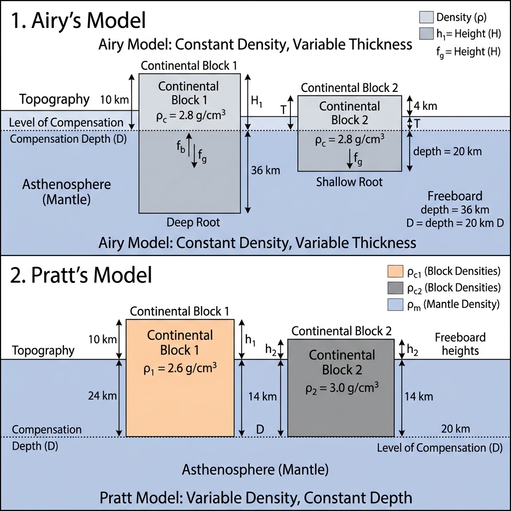

### Isostasy: The State of Crustal Balance

Isostasy (Greek *isos* = equal, *stasis* = standing) is the state of gravitational equilibrium between Earth's crust and mantle, such that the crust "floats" at an elevation based on its thickness and density. This concept explains how different topographic heights (mountains vs. basins) can exist in a stable state.

#### 1. Airy’s Hypothesis (Floating Iceberg Analogy)
Proposed by **Sir George Airy**, this model assumes that the Earth's crust is composed of blocks of **uniform density** but **varying thickness**.
- **Mechanism**: Like an iceberg, taller mountains have deeper "roots" extending into the denser mantle.
- **Key Principle**: "The bigger the mountain, the deeper the root."
- **Application**: Explains why the Himalayas have a massive crustal root (~70km) compared to the oceanic crust (~5-10km).

#### 2. Pratt’s Hypothesis (Varying Density Analogy)
Proposed by **John Henry Pratt**, this model assumes that the blocks of the crust have **varying densities** but extend to a **uniform depth** called the *Level of Compensation*.
- **Mechanism**: Taller landforms (mountains) are made of lighter (less dense) material, while lower-lying areas (basins) are made of denser material.
- **Key Principle**: "Uniform depth, varying density."
- **Application**: Used to explain density variations across different continental segments.

#### Comparison Table

| Feature | Airy's Model | Pratt's Model |
|:---|:---|:---|
| **Density** | Uniform across all blocks | Varies (Inversely with height) |
| **Depth of Root** | Varies (Proportional to height) | Uniform (Level of Compensation) |
| **Analogy** | Icebergs in water | Copper/Iron/Lead blocks in Mercury |
| **Main Contribution** | Concept of crustal roots | Concept of compensation level |

---

> [!TIP]
> **UGC NET Focus**: Questions often ask to distinguish between the "Uniform Density, Varying Depth" (Airy) and "Varying Density, Uniform Depth" (Pratt) principles. Remember: **Airy = Roots**, **Pratt = Density**.
