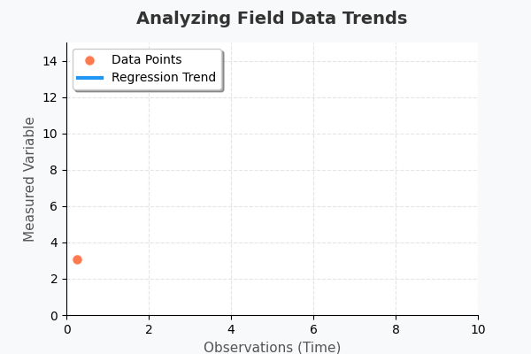



---

Welcome to the **Research Methodology** module of Geography OpenCourseWare.

  

---

## Part A: Common Topics (NEP-2020 & UGC NET)

These topics are covered in both the NEP-2020 undergraduate syllabus and the UGC NET syllabus.







---
