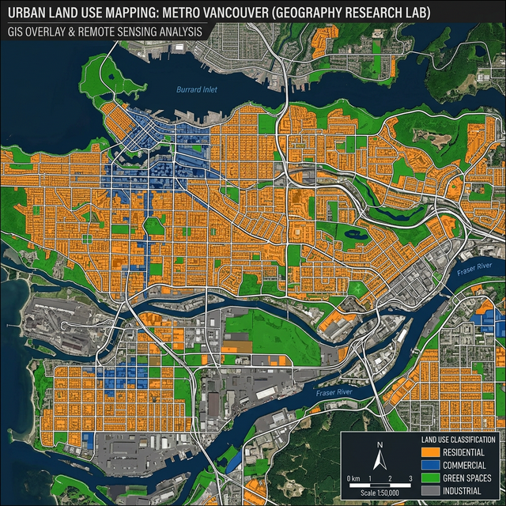
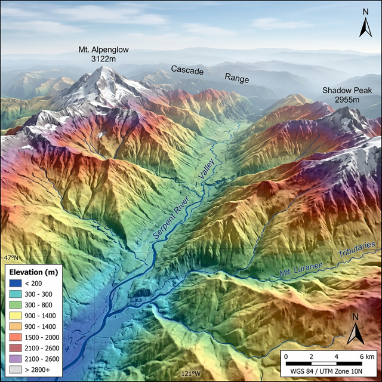
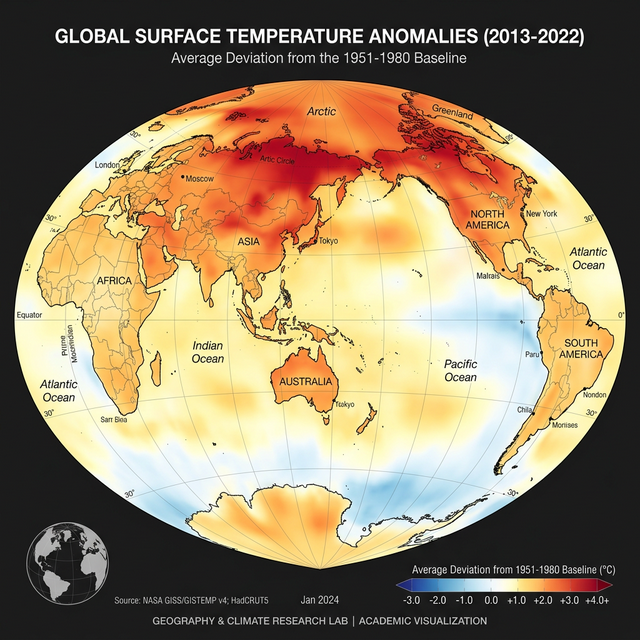

::: {.page-header}
# Research Programs
Computational geospatial science validated through field research
:::

## Overview

Our research agenda integrates deep learning, machine learning, and geospatial cloud computing with systematic field-based ground validation. Every project follows our core philosophy: computational analysis must be validated through rigorous field survey and exploratory research to produce meaningful, reliable geographic outcomes.

---

## Current Projects

### 1. LULC Classification Using Deep Learning with Field Validation {#lulc-dl}

::: {.grid-2}

::: {}
**Status:** <span style="color: #1a8a7d; font-weight: 600;">● Active</span> | **Duration:** 2024 – Present

Developing and comparing deep learning architectures — CNN, U-Net, ResNet-50, and Vision Transformers — for automated land use/land cover (LULC) classification from Sentinel-2 multispectral imagery. All classification results are validated through systematic ground-truth field surveys using GPS-based stratified random sampling across diverse landscape units.

**Methods & Tools:**

- TensorFlow/PyTorch for model development in Python
- Google Earth Engine for image preprocessing and composite generation
- QGIS for spatial data preparation, visualization, and map layout
- Field surveys with GPS/GNSS for training and validation sample collection
- Accuracy assessment: Overall Accuracy, Kappa Coefficient, F1-score, Confusion Matrix

**Key Outcomes:**

- 94.7% overall accuracy for 8-class LULC with field-validated CNN model
- Comparative analysis of 5 DL architectures across 3 geographic regions
- 1,200+ field-validated ground-truth sample points collected
:::

::: {}
{style="border-radius: 12px; width: 100%;"}
:::

:::

---

### 2. Multi-Temporal Change Detection Using GEE & Machine Learning {#change-detection}

::: {.grid-2}

::: {}
{style="border-radius: 12px; width: 100%;"}
:::

::: {}
**Status:** <span style="color: #1a8a7d; font-weight: 600;">● Active</span> | **Duration:** 2023 – Present

Large-scale land cover change analysis using Google Earth Engine's cloud computing platform for multi-temporal Landsat and Sentinel-2 time series processing. Machine learning classifiers (Random Forest, XGBoost, SVM) are applied in R and Python, with change trajectories validated through sequential field surveys and historical land records.

**Methods & Tools:**

- Google Earth Engine JavaScript/Python API for annual composites and spectral indices
- Random Forest and Gradient Boosting classifiers in R (caret, randomForest)
- Python (scikit-learn) for model comparison and feature importance analysis
- QGIS for post-classification filtering and cartographic outputs
- Field-based sequential exploratory research at change hotspots

**Key Outcomes:**

- 30-year land cover change analysis spanning 1993–2023
- Identification of urban expansion corridors with 92% change detection accuracy
- Field verification at 200+ randomly selected change/no-change locations
:::

:::

---

### 3. Spatial Climate Variability Modeling with ML & Ground Observations {#climate-ml}

::: {.grid-2}

::: {}
**Status:** <span style="color: #1a8a7d; font-weight: 600;">● Active</span> | **Duration:** 2024 – Present

Machine learning-driven spatial analysis of climate variability patterns including temperature anomalies, precipitation trends, and urban heat islands. Models are trained using gridded reanalysis datasets (ERA5, CRU) and satellite-derived Land Surface Temperature (LST), validated against meteorological ground station observations and field-deployed weather sensors.

**Methods & Tools:**

- Python (xarray, rioxarray) for climate data processing
- Random Forest, XGBoost, and ensemble stacking in R and Python
- Google Earth Engine for MODIS LST and NDVI time series extraction
- QGIS for spatial interpolation (IDW, Kriging) and vulnerability mapping
- In-situ temperature and precipitation data from field-deployed sensors

**Key Outcomes:**

- Urban heat island intensity maps validated against 50+ field measurement points
- Precipitation trend analysis covering 40-year period with 85% spatial R²
- Climate vulnerability index maps for 3 metropolitan study areas
:::

::: {}
{style="border-radius: 12px; width: 100%;"}
:::

:::

---

### 4. Crop Type Mapping with SAR-Optical Fusion & Ground Survey {#crop-mapping}

**Status:** <span style="color: #1a8a7d; font-weight: 600;">● Active</span> | **Duration:** 2025 – Present

Fusioning Sentinel-1 SAR with Sentinel-2 optical data using attention-based deep learning architectures for crop type classification in cloud-prone regions. Training data is collected through extensive ground-truth field surveys involving GPS-referenced plot-level crop identification and farmer interviews.

**Methodology Pipeline:**

1. GEE-based multi-temporal SAR (VV, VH) and optical (10 spectral bands) composite generation
2. Attention-based CNN fusion model developed in PyTorch
3. Time-series phenology analysis using Dynamic Time Warping in Python
4. Field survey across 300+ agricultural plots for crop type and planting date validation
5. Accuracy assessment through stratified cross-validation and independent test set evaluation

---

### 5. Urban Flood Vulnerability Assessment: GIS-ML Integration {#flood-vulnerability}

**Status:** <span style="color: #f0a500; font-weight: 600;">● In Progress</span> | **Duration:** 2025 – Present

Developing a multi-criteria GIS framework integrated with machine learning for urban flood vulnerability mapping. The project combines QGIS-based terrain analysis (slope, TWI, flow accumulation), socioeconomic indicators, and land cover data, with Random Forest and Logistic Regression models. Results are validated through field-based flood occurrence surveys and community interviews.

**Tools Stack:**

- QGIS: DEM processing, terrain derivatives, spatial overlay analysis
- Python (scikit-learn): ML model development and hyperparameter tuning
- R (sf, tmap): Spatial visualization, statistical analysis, and map production
- GPS-based field surveys at historically flood-affected locations

---

### 6. GEE-Based Vegetation Health Monitoring with Ground Validation {#vegetation-monitoring}

**Status:** <span style="color: #1a8a7d; font-weight: 600;">● Active</span> | **Duration:** 2024 – Present

Automated vegetation health assessment using NDVI, EVI, and SAVI indices computed in Google Earth Engine from Sentinel-2 and MODIS data. Trend analysis using Mann-Kendall tests and Sen's slope estimation in R. Anomaly detection validated through field-measured LAI (Leaf Area Index) and biomass sampling.

---

## Completed Projects

| Project | Duration | Tools Used | Key Outcome |
|:--------|:---------|:-----------|:------------|
| Wetland Mapping with Random Forest & Field Survey | 2022–2024 | GEE, R, QGIS, GPS | Wetland classification with 91% accuracy across 5 sites |
| Historical LULC Change Analysis (1990–2020) | 2020–2022 | GEE, Python, QGIS | 30-year change atlas with trend analysis for 3 districts |
| Groundwater Vulnerability (DRASTIC-GIS) | 2019–2021 | QGIS, ArcGIS, Field Survey | Vulnerability maps validated with borehole water quality data |
| Accessibility Analysis for Healthcare Facilities | 2018–2020 | QGIS, Python (NetworkX) | Network-based accessibility indices for rural areas |
| Cultural Heritage Documentation | 2017–2019 | UAV, Photogrammetry, QGIS | 3D photogrammetric models of 12 heritage sites |

---

## Research Methodology Framework

```{mermaid}
%%| fig-width: 8
graph TD
    A["<b>Spatial Geography Lab</b><br>Research Pipeline"] --> B["Data Acquisition"]
    A --> C["Computational Analysis"]
    A --> D["Field Validation"]
    A --> E["Outcomes & Impact"]
    
    B --> B1["Sentinel-1/2, Landsat, MODIS"]
    B --> B2["UAV/Drone Surveys"]
    B --> B3["Open Geospatial Data"]
    
    C --> C1["Deep Learning<br>CNN, U-Net, ViT"]
    C --> C2["Machine Learning<br>RF, XGBoost, SVM"]
    C --> C3["GEE Cloud Processing"]
    C --> C4["QGIS Spatial Analysis"]
    C --> C5["Python & R Pipelines"]
    
    D --> D1["GPS Ground-Truth Survey"]
    D --> D2["Exploratory Field Research"]
    D --> D3["Accuracy Assessment"]
    D --> D4["In-situ Measurements"]
    
    E --> E1["Validated Thematic Maps"]
    E --> E2["Peer-Reviewed Publications"]
    E --> E3["Open Datasets & Code"]
    E --> E4["Policy Recommendations"]

    style A fill:#0e4d6e,stroke:#0a1628,color:#fff
    style B fill:#1a8a7d,stroke:#0a1628,color:#fff
    style C fill:#1a8a7d,stroke:#0a1628,color:#fff
    style D fill:#1a8a7d,stroke:#0a1628,color:#fff
    style E fill:#1a8a7d,stroke:#0a1628,color:#fff
```

---

::: {.info-box}
#### <i class="fas fa-flask"></i> Interested in Our Research?
We are always looking for motivated researchers and students with skills in Python, R, GEE, QGIS, or field survey methods. [Contact us](contact.qmd) to explore research opportunities.
:::
